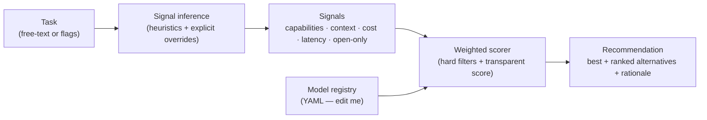

# model-router

**Pick the right LLM for the task — instead of paying frontier prices for everything.**

`model-router` is a small, config-driven tool that scores a task against a registry
of models and tells you which one to use, why, and what it'll roughly cost
relative to the alternatives. It's provider-agnostic: it covers Anthropic Claude
(Opus / Sonnet / Haiku) **and** open / self-hostable models (GLM, Llama, DeepSeek)
and a GPT-class entry — so it's useful inside Claude Code *or* when you're running
open models.

The router is **pure logic**: no network calls, no API key, deterministic output.
Clone it and it just runs.

---

## The problem

Reaching for one big model for every task is the most common way teams waste money
and underperform at the same time:

- A frontier reasoning model to **classify 50,000 support tickets** burns cash and
  latency on a job a small model nails.
- A cheap, fast model on a **hard architectural refactor** gives you confident
  wrong answers.
- "Use an open model" is a real constraint (air-gapped, on-prem, cost) that a
  hardcoded default ignores.

The right model is a function of the *task signals* — needed capabilities,
context size, cost sensitivity, latency sensitivity, and whether it must be
self-hostable. `model-router` makes that function explicit, transparent, and
editable.

---

## How it works



1. **Signals** are inferred from your task text (keyword heuristics) and/or set
   explicitly with flags. Explicit flags always win.
2. **Hard filters** drop models that can't qualify (closed model under
   `--open-only`, context window too small, etc.) — each with a reason.
3. A **transparent weighted score** ranks the survivors. Every component
   (capability match, cost, speed, context headroom, reasoning depth) is named
   and returned in the breakdown — no black box.
4. You get the **best pick, ranked alternatives, a human-readable rationale, and a
   relative cost note**.

---

## Quickstart

```bash
git clone <your-fork-url> model-router
cd model-router
python -m venv .venv && source .venv/bin/activate
pip install -e .

# Recommend a model for a task
route "design a fault-tolerant distributed system and reason through the trade-offs"

# Just the id, for scripting / auto-switching (pipe-friendly)
route "classify 50k tickets by sentiment, cheapest option" --auto
# -> a cheap model id, nothing else

# List the registry
route models
```

No API key. No network. It's all local scoring.

---

## Example runs

**Deep reasoning task → Opus wins, alternatives ranked:**

```text
$ route "design a fault-tolerant distributed system and reason through the trade-offs"
                                  Recommendation
┏━━━━━━┳━━━━━━━━━━━━━━━━━━━┳━━━━━━━━━━━┳━━━━━━━━┳━━━━━━┳━━━━━━━┳━━━━━━━━━━━━━━━━━━┓
┃ rank ┃ model             ┃ provider  ┃  score ┃ cost ┃ speed ┃ why              ┃
┡━━━━━━╇━━━━━━━━━━━━━━━━━━━╇━━━━━━━━━━━╇━━━━━━━━╇━━━━━━╇━━━━━━━╇━━━━━━━━━━━━━━━━━━┩
│    ★ │ claude-opus-4-8   │ anthropic │ 17.375 │ 5/5  │  2/5  │ covers reasoning │
│    2 │ gpt-class-large   │ openai    │ 17.125 │ 4/5  │  3/5  │ covers reasoning │
│    3 │ claude-sonnet-4-6 │ anthropic │   16.5 │ 3/5  │  3/5  │ covers reasoning │
└──────┴───────────────────┴───────────┴────────┴──────┴───────┴──────────────────┘

Rationale: Chose claude-opus-4-8 (anthropic). Task needs: reasoning. Relative cost
tier 5/5 (1=cheapest), speed tier 2/5 (5=fastest). Deepest reasoning. Long-horizon
agentic work, hard refactors, research.
```

**Open-only constraint → closed models excluded, open winner chosen:**

```text
$ route "coding agent that must run fully self-hosted on-prem" --open-only
                                   Recommendation
┏━━━━━━┳━━━━━━━━━━━━━━━┳━━━━━━━━━━┳━━━━━━━━┳━━━━━━┳━━━━━━━┳━━━━━━━━━━━━━━━━━━━━━━━━━┓
┃ rank ┃ model         ┃ provider ┃  score ┃ cost ┃ speed ┃ why                     ┃
┡━━━━━━╇━━━━━━━━━━━━━━━╇━━━━━━━━━━╇━━━━━━━━╇━━━━━━╇━━━━━━━╇━━━━━━━━━━━━━━━━━━━━━━━━━┩
│    ★ │ deepseek-v3   │ deepseek │ 26.125 │ 1/5  │  4/5  │ covers coding, tool_use │
│    2 │ glm-4.5-air   │ zhipu    │ 26.125 │ 1/5  │  4/5  │ covers coding, tool_use │
│    3 │ llama-3.3-70b │ meta     │ 26.125 │ 1/5  │  4/5  │ covers coding, tool_use │
└──────┴───────────────┴──────────┴────────┴──────┴───────┴─────────────────────────┘

Excluded by hard filters:
  - claude-opus-4-8: closed weights (open-only required)
  - claude-sonnet-4-6: closed weights (open-only required)
  - ...
```

**Scripting with `--auto` (auto-switching a session):**

```bash
$ route "summarize a 400k token legal transcript" --auto
claude-sonnet-4-6

# Use it directly:
MODEL=$(route "deep reasoning task" --auto)
echo "Routing to $MODEL"
```

---

## Flags

| Flag             | Effect                                              |
|------------------|-----------------------------------------------------|
| `--auto`         | Print only the chosen model id (pipe-friendly)      |
| `--cheap`        | Force cost-sensitive                                 |
| `--fast`         | Force latency-sensitive                              |
| `--reasoning`    | Require the `reasoning` capability                   |
| `--coding`       | Require the `coding` capability                      |
| `--vision`       | Require the `vision` capability                      |
| `--tool-use`     | Require the `tool_use` capability                    |
| `--open-only`    | Only consider open-weights / self-hostable models    |
| `--max-context N`| Require a context window of at least N tokens        |
| `--top N`        | Show N ranked models (default 3)                     |
| `--registry P`   | Use a custom registry YAML/JSON instead of bundled   |

Flags are **overrides** layered on top of inferred signals (capabilities union,
boolean flags OR-in), so `route "classify tickets" --reasoning` adds reasoning to
whatever was inferred.

---

## Editing the registry

The registry is the only file you normally touch:
[`model_router/registry.yaml`](model_router/registry.yaml). Add a model by
appending an entry:

```yaml
  - id: my-new-model
    provider: acme
    open_weights: true
    context_window: 128000
    capabilities: [coding, tool_use, cheap_bulk]
    cost_tier: 2      # 1=cheapest ... 5=priciest (RELATIVE — edit me)
    speed_tier: 4     # 1=slowest  ... 5=fastest (RELATIVE — edit me)
    notes: "Why you'd reach for this."
```

The router picks it up immediately — no code changes. Point at a custom file with
`route "..." --registry ./my-registry.yaml`.

> **On pricing:** cost/speed are **coarse, approximate tiers, not dollar prices.**
> Real prices drift constantly, so the tool deliberately avoids asserting exact
> numbers as fact. When you care about precise spend, update `cost_tier` from the
> provider's current pricing page. Accuracy beats false precision.

---

## Use inside Claude Code (or with open models)

There's a ready-made Claude Code skill in [`skill/SKILL.md`](skill/SKILL.md) that
wraps `route --auto` so an agent can auto-pick or switch the model for the current
task — and it works equally well for open models like GLM if that's where you're
running.

---

## Stack

- **Python 3.11+**
- [`pydantic`](https://docs.pydantic.dev/) — validated, immutable data models
- [`pyyaml`](https://pyyaml.org/) — registry parsing
- [`rich`](https://rich.readthedocs.io/) — the recommendation table
- `pytest` for tests, `ruff` for lint. `anthropic` is an **optional** dep used only
  by an optional live "explain" mode — never required to run the router.

---

## Roadmap

- Optional live "explain" mode: have a model narrate the trade-off in prose (uses
  the optional `anthropic` dep / env key — see `.env.example`).
- Pluggable scoring profiles (e.g. "cost-first", "quality-first") selectable by flag.
- A tiny `route serve` HTTP endpoint for routing as a service.
- Per-provider price sync helper to refresh `cost_tier` from public pricing pages.

---

## About

Personal project, built with Claude Code. AI-assisted. The model registry's
cost/speed tiers are approximate and meant to be edited — see the note above.
MIT licensed. No real API keys, employer data, or confidential information is used
anywhere in this repo; all examples use generic placeholders.

## Origin

This is a **clean-room, generic version** of tooling I build and use locally for real operational and process work. The internal originals stay private; this public version is sanitized — synthetic data only, no proprietary logic — and generalized so anyone (including me) can reuse it via [Claude Code](https://claude.com/claude-code). Built and maintained AI-assisted.
